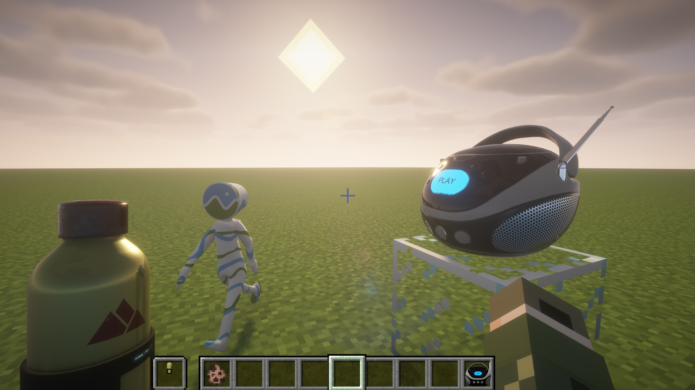

# glTF Material Converter Pack
This repo provides several glTF Material Converter Packs for [CRglTF](https://github.com/TimLee9024/CRglTF) to convert PBR material from glTF V2 file into custom material format used by shader pack.

Download them at the [Latest Releases](https://github.com/TimLee9024/glTF-Material-Converter-Pack/releases/latest).

Below are the results of each glTF Material Converter Pack by using [CRglTF-Example](https://github.com/TimLee9024/CRglTF-Example).
## BSL Shaders: SEUS/Old PBR

## BSL Shaders: LabPBR 1.3

### Note
For LabPBR 1.3 Converter Pack, the PBR Metallic to the Green Channel of Specular texture is just a **Visually Acceptable** conversion. Please using BSL SEUS PBR Converter Pack if you want exact PBR result as in glTF V2 specs.
